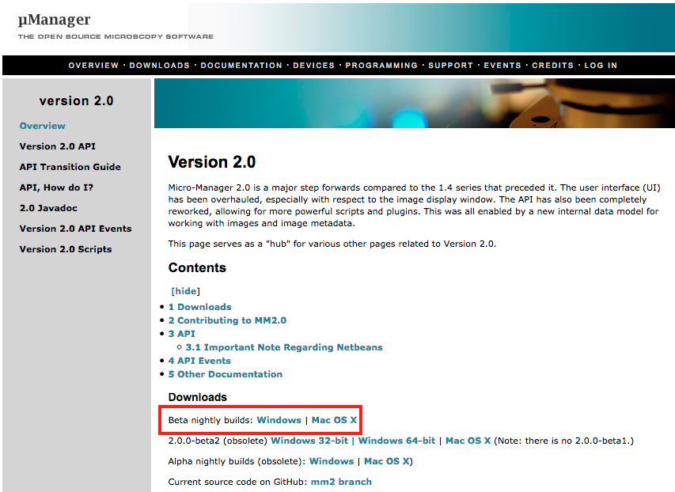

# MAARS Manual (v1.0.0)
This manual should be applicable to all OSs (Ubuntu16.04/MacOS Sierra/Win7  guarantee) 
## Build the environment
* **Anaconda** :  
[Download Anaconda](https://www.continuum.io/downloads) and then install to its _default (important)_ folder.
* **MicroManager 2.0** :  
Download the `nightly build 20161211` [Version 2.0 - Micro-Manager](https://micro-manager.org/wiki/Version_2.0)  (later versions are not guaranteed)

 and install Micro-Manager 2.0. It can be installed to anywhere you want.
* **Java 1.8**
	1. Download [Java SE Runtime Environment 8](http://www.oracle.com/technetwork/java/javase/downloads/jre8-downloads-2133155.html) and Install Java 8 to anywhere you want (_please note where you’ve installed it_).
	2. Remove the ‘jre’ folder from the root folder of MM, or delete it. _Note :_ the fact of removing or deleting it from MM won’t change any functionality of MM.
	3. Next time when you start MM, it will let you configure the Java path. Specify where you’ve installed Java 8. If you didn’t change the installation path, it should be in `/Library/Java/JavaVirtualMachines/` for macOS, `/usr/lib/jvm/` for Ubuntu and `C:\Program Files\Java\` for windows.
* **RAM** :  
the more the better. The minimum requirement depends on:
	* If you want to perform a normal acquisition with or without on-the-fly analysis. **4G** should be enough.
	* if you want to perform the post-analysis you will need at least :`number of fluo-channel * 
	number of timepoint * 
	number of z-stack at each timepoint * 
	single image size of your camera` megabytes of of RAM.   Example **2** (channel)  * **90** (3 acquisitions/min during 30 min) * **6** (z-stack) * **10M** = **10800M**, so about **11G** is required.

## Installation
Put the jar file *MAARS-1.0-SNAPSHOT.jar* and the *MAARS_deps* folder into your plugins folder in MM’s root folder.

## Developers
 `build-mm.sh` : use this script to build Micro-Manager under Linux.
 `mavenized-mm.sh` : use this script to update local Maven repository inside `repo/`. MM jars used are `MMJ_`, `MMCoreJ` and `MMAcqEngine`.

`update-libs.sh` : use Maven to build MAARS and copy all dependencies to `jars/`. It allows "basic users" to copy the required .jar file to a standard Micro-Manager installation.

`install.sh` : Use to install MAARS plugin and its dependencies to Micro-Manager installation.
### Eclipse/Netbean/IntelliJ
# Configuration
# TroubleShooting