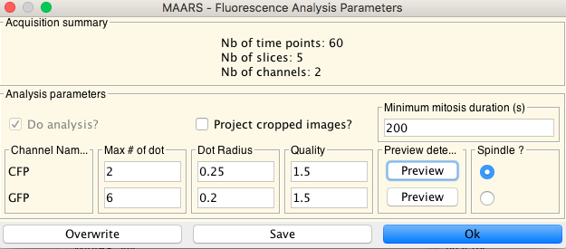
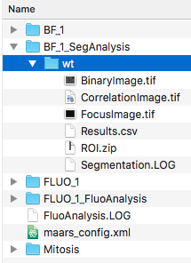

# MAARS post-analysis (beta)  
You should already finished [general installation](install_MAARS.md) before reading this.
## Description
The post-acquisition analysis part is __independent of Micro-Manager__. So that you can run it in Fiji with script panel (this is what we do).  
You can consider the Anaconda part as extensions of MAARS with Python programming language.  

Why Python/Anaconda? 
- It contains almost all the packages I need for our analysis.
- Easy to install
- I just like it. So generally personal choice...

## Installation:
See [general installation](install_MAARS.md)

## Requirements:
You need at least 3 components to run MAARS (besides you may **already segmented your cells** see bottom of this page):
1. A folder that contains bright-field images (folder `BF_1` in our case)
2. A folder that contains fluorescence images (folder `FLUO_1` in our case)
3. A `maars-config.xml` file
Put them in a same root folder. And you are almost ready to run.  
Here is an example:  
![][root_folder]  

### The `maars_config.xml` file
`maars_config.xml` is the recipe for running MAARS.  
You have 3 ways to create this file.
1. Use `fluoConfigurator` (recommanded, see below)
2. Run `batchSegmentation` or `batchFluoanalysis`, it will create one at the root folder if it doesn't exist.
3. Copy-paste [this example](https://github.com/bnoi/MAARS/blob/master/maars_lib/src/main/resources/maars_default_config.xml) and modify manually with text editor  

It comprises 4 sets of parameter concerning `FluoAnalysis`, `GeneralAcquisition`, `Segmentation` and `MitosisDectection`.  
![][config_structure]  
TODO: add detailed description about each parameter...

## How to run MAARS post-acquisition analysis
**IMPORTANT NOTE**: change `SEG_PREFIX` and `FLUO_PREFIX` in the `maars_config.xml` to the name of folders correspondingly. `BF_1` and `FLUO_1` in the example.
1. Open `script panel` of Fiji.  
![][script-panel]  
2. Load [this script][batchMAARS] and select `Python` as language.
If everything went well, you should see text with color like this  
![][python_interpreter]  
3. Click on `Run`, you will get this  
![][post_interface]  
User `Browse` button to load the root folder of the acquisition. 
4. It is recommaned to run the script 3 times in following the order:  
  - Segmentation
  - Configuration of fluoanalysis parameters (for spot detection)
  - Fluo-analysis
5. In `fluoConfigurator` you can tune the parameters for spot detection using `preview` button. It will take the __active image__ as input and find dots using [Trackmate](https://imagej.net/TrackMate). Once you are satisfied with the parameters, overwrite it or save it in the root fodler.  

6. When you've finished segmentation and fluo analysis in the root, you will get newly 
created folders and files as below:  
![][final_res]

## I have my segmentation

Create manually the folder `BF_1_SegAnalysis` and then the folder `wt`.  In the end, put the ROI.zip which contains the segmentations in this folder.  
_note_ : The `wt` is just the last part of your filename e.g. `wt` in `BF_1_MMStack_wt`, `cdc25` in `BF_1_MMStack_cdc25` etc. The fluo-images should be named the same way e.g. `FLUO_1_MMStack_wt` and `FLUO_1_MMStack_cdc25`.  
  
Do this for all the strains and you are ready to run the reste of analysis i.e. `fluoConfigurator` and `batchFluoAnalysis`.

[batchMAARS]: https://github.com/bnoi/MAARS/blob/master/batchMAAR.py
[script-panel]: images/script-panel.png
[python_interpreter]: images/python_interpreter.png
[post_interface]: images/post_interface.png
[final_res]: images/final_res.png
[head]: https://github.com/bnoi/MAARS
[atom]: https://atom.io/
[root_folder]: images/root_folder.png
[config_structure]: images/config_structure.png
[general_param]: images/general_param.png
<a name="myfootnote1">1</a>: In MAARS, by default, we follow Micro-Manager syntax and Micro-Manager
by default always add an `_1` for the first the acquisition. If you forgot to change the name
of acquisition, the number will increment in order to not override older images.

